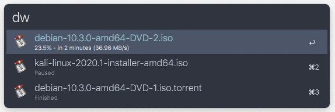

# alfred-github-search

> Alfred workflow to show transmission downloads

**:warning: For this workflow to work, you need to enable the Transmission web interface.**
\
Inside Transmission, go to `Preferences` > `Remote` > check `Enable remote access`

## Download

[Download link](https://github.com/rbaumier/alfred-transmission/raw/master/Transmission.alfredworkflow)

_Requires the Alfred [Powerpack](https://www.alfredapp.com/powerpack/)._

## Usage

In Alfred, type `dw <your optional filter>`.\
Press `<Enter>` to open the torrent location in your finder.

## What it looks like

## Configuration

This workflow uses the following environment variables:

- `transmission_web_url` (default to `http://localhost:9091/transmission/rpc`): this is the url of Transmission remote access.
- `rerun` (default to `1`): after how much seconds do we want to refresh the results (should be between `0.1` and `5`)? This variable is directly passed to the output of alfred to use rerun feature.

## License

MIT © [Romain Baumier](https://twitter.com/rbaumier)
